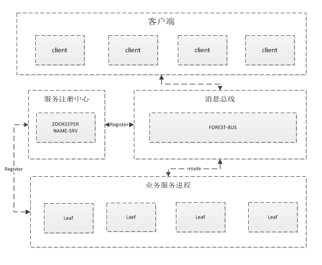

#Forest
>forest是一个基于netty和zookeeper实现的分布式服务框架

##模块
###forest-common
>基础依赖包，实现了name服务，高可用proxy，高可用client，server等

###forest-bus
>消息服务总线，透传消息，根据策略dispatcher消息

###forest-leaf
>业务进程实现示例
>更多详细实现请参照lamp

##依赖
###zookeeper
> 依赖zookeeper实现服务发现

###spring context
>业务框架使用spring作为容器，简化开发

###netty
>依赖netty作为通讯框架

###owner
>依赖owner作配置管理

##功能
###服务发现
>基于zookeeper实现的服务发现

###负载均衡策略
* 默认 default
* 轮叫调度Round Robin
* 加权轮叫Weighted Round Robin
* 哈希调度Hash

##使用示例
* 1.启动zookeeper
* 2.启动forest-bus服务  main (com.dempe.forest.bus.ForestBusServer)
* 3.启动forest-leaf业务进程 main(com.dempe.forest.leaf.LeafServer)
* 4.启动客户端模拟器 main(com.dempe.forest.leaf.simulator.LeafSimulator)

##TODO
>目前仅实现核心功能，更多细节待完善